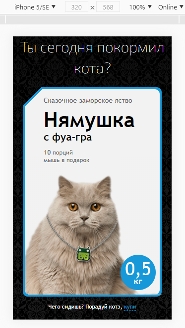
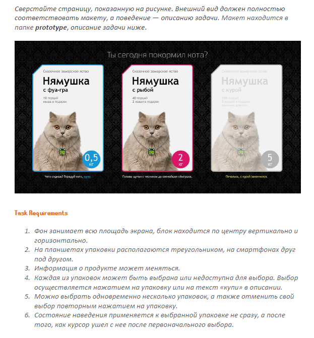

# FUN-BOX

Тестовое задание Level2 на позицию "HTML/CSS/JS разработчика". Компания "FUNBOX"

* Gulp
* Pug
* SCSS
* IE11 Support

## Демо [FUN-BOX](https://volkovva.github.io/fun-box/)




## Установка проекта

* установите ```gulp``` глобально: ```yarn global add gulp-cli```
* скачайте необходимые зависимости: ```yarn```
* чтобы начать работу, введите команду: ```yarn run dev``` (режим разработки)
* чтобы собрать проект, введите команду ```yarn run build``` (режим сборки)