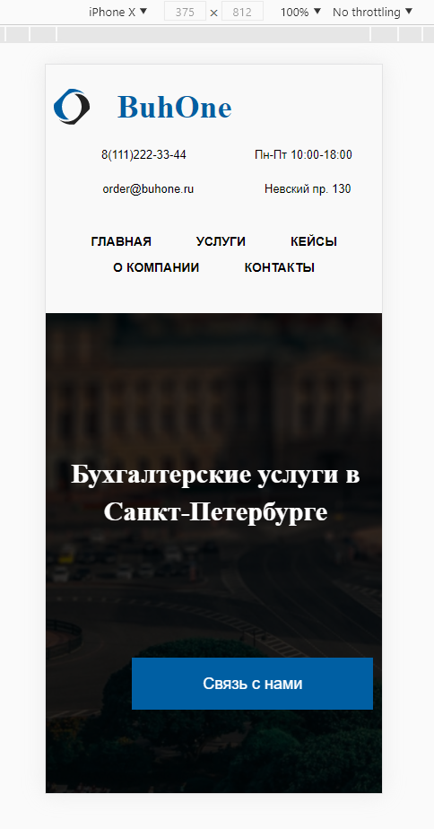

# BuhOne

Test task for the position of "HTML coder". Company "Бизнес Рост"

#### FrontEnd
* Pug
* SCSS
* JavaScript
* Adaptive

#### Workflow
* Gulp
* Git
* Yarn

#### Code native JavaScript

* Photo in the modal window
* Accordion
* YandexMap

#### Plugins

* Swiper Slider native JS

## Live Demo: [Buhone](https://volkovva.github.io/test-tasks/buhone/)




## Project Installation

* install ```gulp``` globally ```yarn global add gulp-cli```
* download the necessary dependencies: ```yarn```
* to get started, enter the command: ```yarn run dev``` (development mode)
* to build a project, enter the command: ```yarn run build``` (build mode)