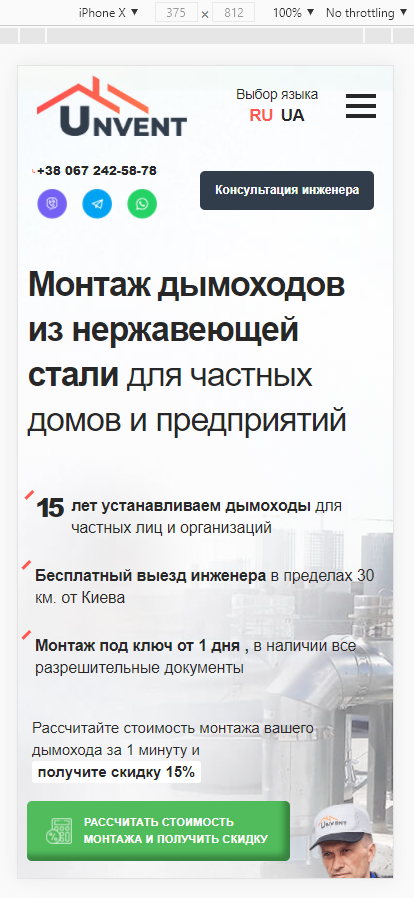

# unvent

```
Тестовое задание на позицию "HTML-верстальщик (Frontend-разработчик)" компания "Paradigma.Website"
```

#### FrontEnd
* Pug
* SCSS
* JavaScript

#### Workflow
* Gulp
* Git
* Yarn

#### Код native JavaScript

* YandexMap в модальном окне
* Burger Menu

#### Плагины

* Swiper Slider native JS
* Fancybox jQuery




### Установка проекта

* установить ```gulp``` глобально: ```yarn global add gulp-cli```
* скачать необходимые зависимости: ```yarn```
* чтобы начать работу, ввести команду: ```yarn run dev``` (режим разработки)
* чтобы собрать проект, ввести команду ```yarn run build``` (режим сборки)