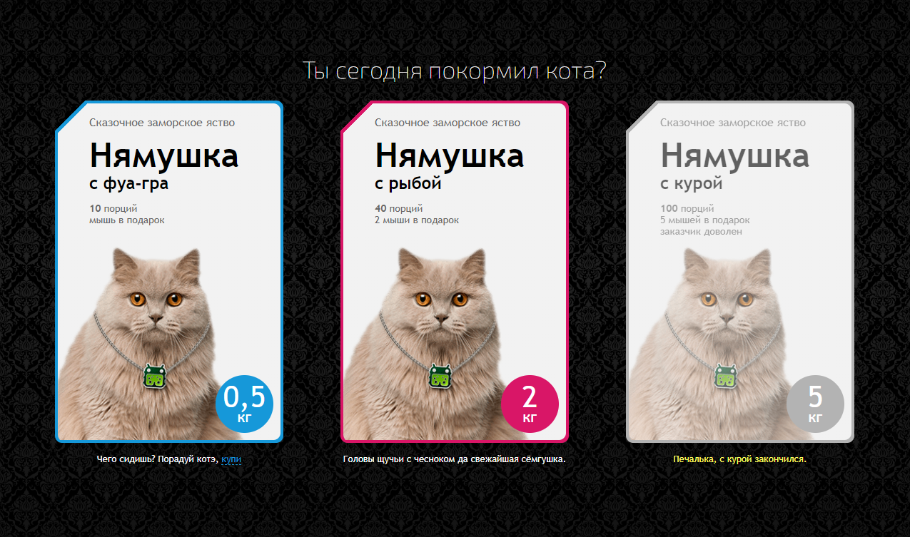
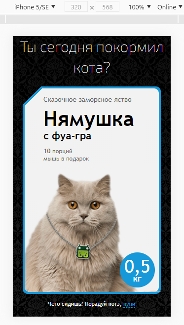
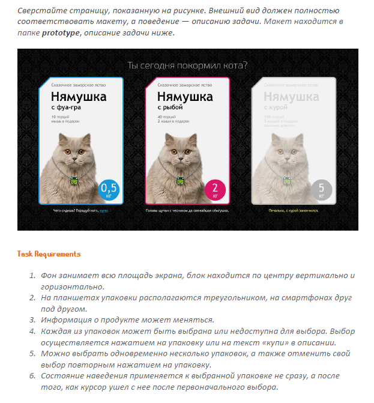

# FUN-BOX

Level 2 test task for the position of "HTML/CSS/JS developer". Company "FUNBOX"

* Gulp
* Pug
* SCSS
* IE11 Support

## Live Demo: [Fun-Box](https://volkovva.github.io/test-tasks/fun-box/)





## Project Installation

* download the necessary dependencies: ```yarn```
* to get started, enter the command: ```gulp``` (development mode)
* to build a project, enter the command: ```gulp prod --production``` (build mode)