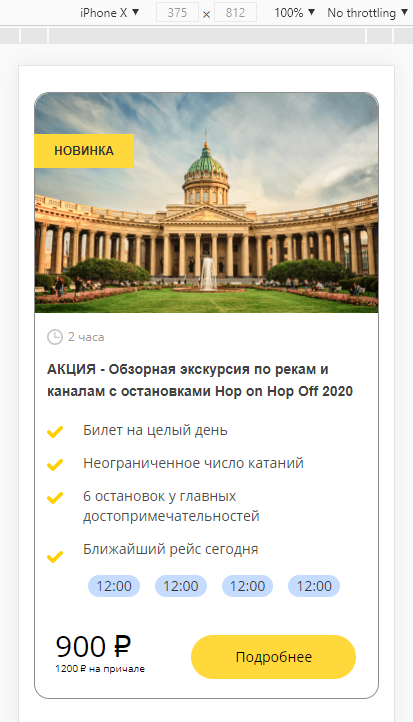

# nevatrip

Test task for the position of "HTML-layout designer". Company "Nevatrip"

## Task Description: [Description](https://github.com/Nevatrip/layout-test-task)
## Live Demo: [Nevatrip](https://volkovva.github.io/test-tasks/nevatrip/)




## Project Installation

* install ```gulp``` globally: ```yarn global add gulp-cli```
* download the necessary dependencies: ```yarn```
* to get started, enter the command: ```yarn run dev``` (development mode)
* to build a project, enter the command: ```yarn run build``` (build mode)